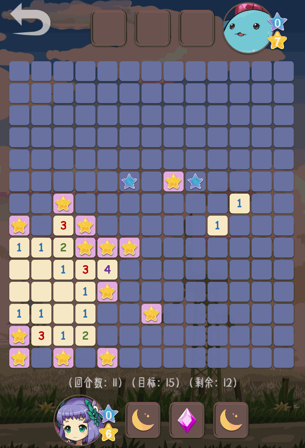

# StarSeekerRL（施工中）
《寻星者》是一款逆向扫雷双人对战游戏！本工程将寻找效果良好、成本低廉、扩展性强的强化学习解决方案😍。

在游戏中，获得更多的“星星”（就是雷啦）是唯一的目标！灵活使用技能，做出利好得分的决策吧！🤩

游玩链接：1️⃣[PC版](https://wwsyan.github.io/StarSeeker_WebDesktop/)；2️⃣[移动设备版](https://wwsyan.github.io/StarSeeker_WebMobile/)。

### 关于技能
#### 技能的种类
目前提供了4种技能：

1️⃣**守护之盾**：使 $5×5$ 范围内的方块不能被点击，对方行动两次后解除。

  
图示

  

2️⃣**火球术**：摧毁 $5×5$ 范围内的星星。

  
图示

  

3️⃣**入梦**：清空自身当前回合的行动数，使下回合行动数+1。

  
图示

  

4️⃣**重启**：保持当前场上的剩余星数不变，重置星盘。

  
图示

  

#### 技能的获取
- 部分人物每隔一定的回合，会自动获得一张特定的技能卡；
- 每隔一定的回合，场上会出现“蓝星”，点击蓝星，会获得技能池中的随机一个技能。

## 强化学习方案设计
- 框架：层级化强化学习，具有较好的可扩展性，每个技能的决策可以单独设计，新技能也能自然地加入；
- 奖励：避免稀疏奖励，考虑3回合内双方得分的差值作为奖励；
- 组件——特征提取器：对环境观测信息进行加工；
- 组件——动作筛选器：适当过滤掉明显不合理的动作；
- 组件——策略优化器：使用一些规划算法，比如MCTS，提高决策质量；
- 组件——专家知识对手：一个好的对手，能让训练更高效。

## 施工计划
|条目|状态| 
|:---:|:---:|
|环境搭建|✔|
|环境特征提取器|✔|
|rule-based技能AI|✔|
|专家知识AI|✔|
|层级化PPO|未测试|
|构建Gym的空间类型：层级字典|施工中|
|技能“入睡”和“重启”的监督学习模型|待施工|
|动作筛选器|待施工|
|适配的MCTS插件|待施工|

### 专家知识AI一览

  
图示

  

